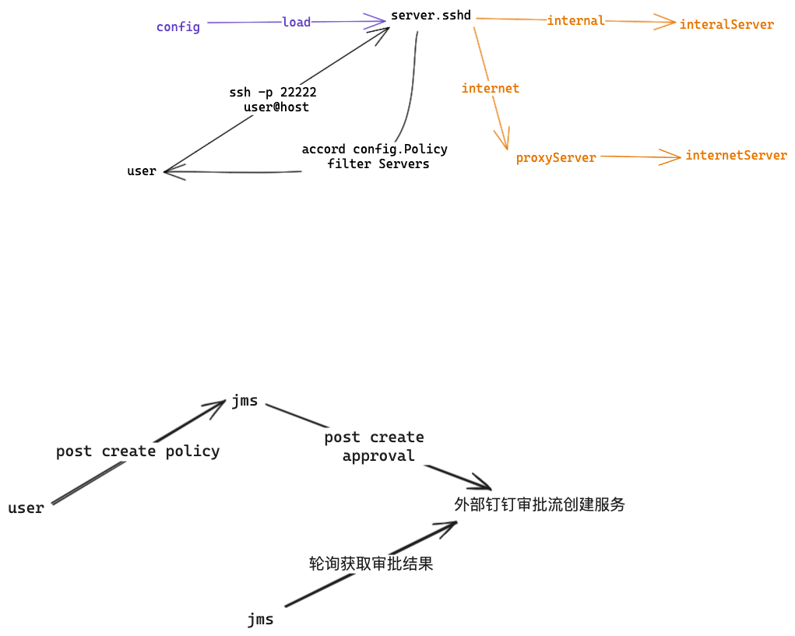
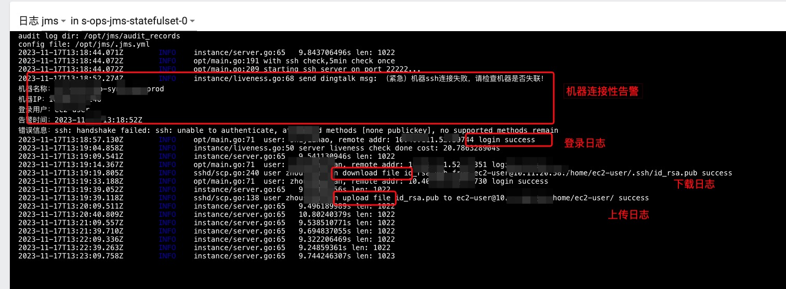

## 背景
1. 公司需要管理大量的资产，需要一个简单的工具来管理资产；
2. 每个团队都有连接资产的需求，需要一个简单的工具来连接资产；
3. 每个团队都有文件传输的需求，需要一个简单的工具来传输文件；
4. 介于公司还有大量的海外机器，还会出现访问速度慢的问题，Jumpserver在这块用来异步的 ansible来推送用户经常出现失败的痛点；

## 简介
`jms`是一款轻量级的云服务器链接工具，
- 支持ldap登录认证
- 支持多云服务器资产自动发现（目前支持aws,tencent）
- 支持基于机器标签的权限管理
- 支持权限申请和审批功能（自带或者接入钉钉）
- 支持文件上传下载
- 支持操作日志回放功能
- 支持机器可连接性监控告警功能

## 如何部署
云接入 JMS 准备工作：
1. 需要云上有一个服务器只读权限的服务用户，提供 AKSK；
2. 如果云服务器全内网隔离，（jms服务和云环境不在一个内网）需要提供一个jms能连接到的公网jms_proxy的机器，要求该机器白名单22放行 jms出口(52.83.249.14)，且该 proxy服务需要和内网段的其他需要被ssh的机器 22 要放通；

## 特别感谢
- [TNK-Studio/gortal](https://github.com/TNK-Studio/gortal.git)
## 设计拓扑


## 使用手册

```bash
# 设置免密登录
# ssh-copy-id -p 22222 登录用户@jms域名
ssh-copy-id -p 22222 zhoushoujian@localhost

# 登录
# ssh -p 22222 登录用户@jms域名
ssh -p 22222 zhoushoujian@localhost

# 权限
# 基于机器标签 tag做了 2 个策略
# 1. 机器标签Owner=登录用户，可以看到
# 2. 机器标签Team=登录用户所在的Team，可以看到

# 文件传输
# 上传 scp -P 22222 本地文件  登录用户@jms域名:远端服务器用户@远端服务器IP地址:远端服务器文件路径
[root@zhoushoujianworkspace jms]# scp -P 22222 ./README.md  zhoushoujian@localhost:ec2-user@192.168.1.1:/tmp/README1.md
README.md                                     100% 2506     2.9KB/s   00:00    
# 下载 scp -P 22222 登录用户@jms域名:远端服务器用户@远端服务器IP地址:远端服务器文件路径 本地文件
[root@zhoushoujianworkspace jms]# scp -P 22222 zhoushoujian@localhost:ec2-user@192.168.1.1:/tmp/README1.md /tmp/README.md
README1.md                                    100% 2506     1.8MB/s   00:00


# docker启动
docker run --rm --network=host -dit -v /root/jms/ssh/:/root/.ssh/ -v /root/jms/jms.yml:/opt/jms/.jms.yml -p 22222:22222 --name jms_test -e WITH_SSH_CHECK=true zhoushoujian/jms:latest

# k8s 部署，完善好 configmap配置后，直接部署即可
kubectl apply -f sstatefulset.yaml -n jms --create-namespace

```


## 大功能点设计思路讲解
### 1. 资产权限的申请和审批
申请方式支持 2 种：
1. 支持cli直接选择权限申请，快捷方便，但是功能单一；
2. 复杂策略的权限申请需要通过API调用的方式实现，具体可以查看swagger文档（http://localhost:8013/swagger/index.html），创建策略是通过 approval审批接口申请；

如何通过审批？
1. 通过API调用的方式，可以通过API调用的方式实现；
2. 在使用系统默认工单审批方式时候，拥有admin组的用户还可以通过登录后的选择也查看和处理需要审批的工单；
如果使用了外部关联的审批方案（即完全通过API实现权限管理），第二种就不会出现啦。


默认就有的策略：
1. tag:Owner=user;
2. tag:Team和你jms用户信息组一致；




## 开发计划
- [√] API 管理 Policy；
- [ ] 用户首次登录初始化用户信息，配置用户组；
- [√] 接入钉钉审批功能；
- [ ] 优化文件传输方式，支持scp后文件选择传输，简化传输命令；

## 开发日志
### 2024-01
- feat: 支持钉钉审批功能：
- feat: 支持audit日志定时清理
- feat: 支持服务器标签EnvType !不等于的匹配规则

### 2023-12
- feat: 增加API管理；
- chore: 优化交互界面；
- feat:支持会话超时退出功能；
- feat: 支持基于 sqlite的独立审批功能；

### 2023-11
- 支持监控机器连接性告警功能；
- 支持scp复制功能；
- 支持配置热更新；

### 2023-10
- 支持 ssh-copy-id 设置，并通过密钥验证登录；

### 2023-09
- 支持输入过滤功能；
- 支持设置策略，只能看到授权的资产；
- 增加录像功能；

### 2023-08
- 基本功能上线
- 增加资产分类，基于账号和区域
- 增加 ldap认证功能
